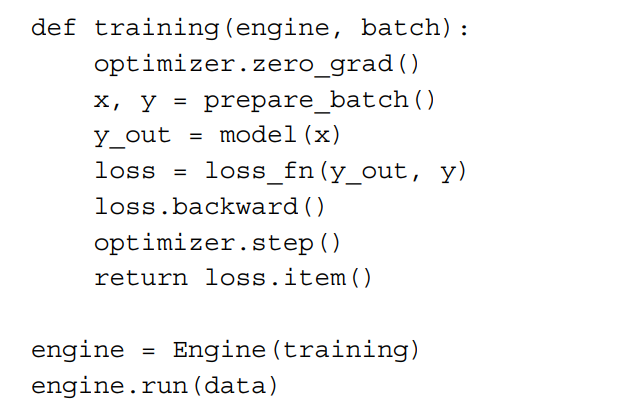
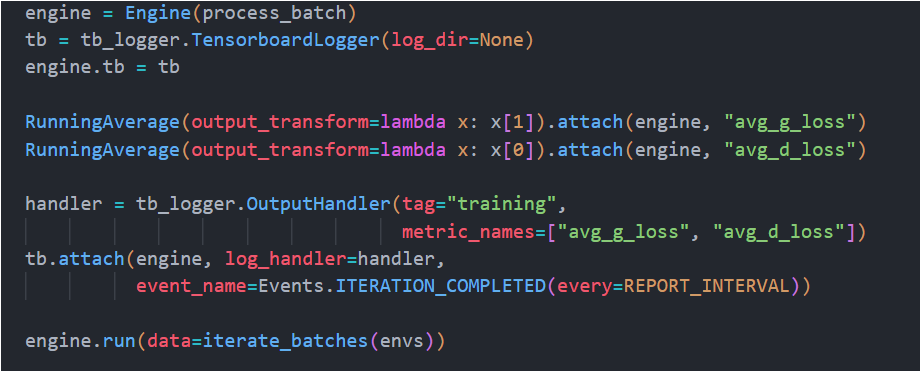

Training Phase Summary 1. Iterate over batches:
○ For each batch from iterate_batches(envs, BATCH_SIZE), we perform the following steps:
○ Increment iteration number (iter_no). 2. Create random noise vector for the Generator:
○ gen_input_v: A random noise vector of shape (BATCH_SIZE, LATENT_VECTOR_SIZE, 1, 1) is generated from a normal distribution, which serves as the input to the Generator. 3. Generate fake images using the Generator:
○ gen_output_v: The Generator (net_gener) takes the random noise vector and produces fake images of shape (BATCH_SIZE, 3, 64, 64). 4. Train the Discriminator:
○ Reset gradients: dis_optimizer.zero_grad() ensures gradients are reset before backpropagation.
○ Discriminator processes real images: disoutput_true_v = net_discr(batch_v) processes the real images in the batch.
○ Discriminator processes fake images: disoutput_fake_v = net_discr(gen_output_v.detach()) processes the fake images generated by the Generator. The .detach() ensures the Generator’s weights aren’t updated during this phase.
○ Calculate Discriminator loss: dis_loss_v = objectives(disoutput_true_v, true_labels_v) + objectives(disoutput_fake_v, fake_labels_v)
○ Backpropagate Discriminator loss: dis_loss_v.backward() computes gradients for Discriminator.
○ Update Discriminator weights: dis_optimizer.step() updates the weights of the Discriminator based on computed gradients.
○ Track Discriminator loss: dis_losses.append(dis_loss_v.item()) stores the Discriminator loss value. 5. Train the Generator:
○ Reset gradients for Generator: gen_optimizer.zero_grad() prepares for Generator’s backpropagation.
○ Discriminator’s prediction for fake images: dis_output_v = net_discr(gen_output_v) processes fake images (without .detach(), so the Generator’s weights are updated here).
○ Calculate Generator loss: gen_loss_v = objectives(dis_output_v, true_labels_v)
○ The Generator loss measures how well the Generator convinces the Discriminator that fake images are real.
○ Backpropagate Generator loss: gen_loss_v.backward() computes gradients for Generator.
○ Update Generator weights: gen_optimizer.step() updates the Generator’s weights based on computed gradients.
○ Track Generator loss: gen_losses.append(gen_loss_v.item()) stores the Generator loss value.

Ignite concept: just to speed up coding process and manage metric easier

